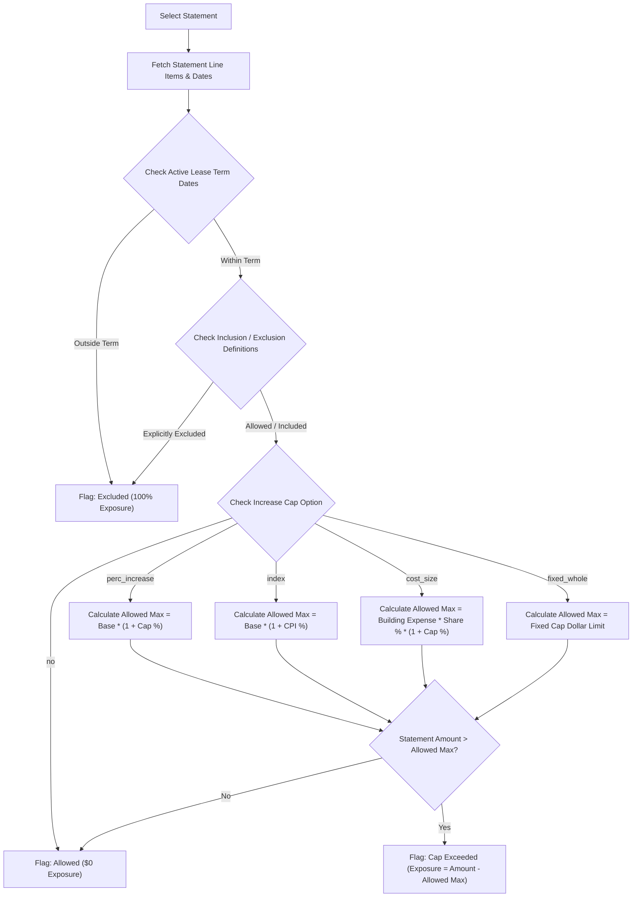
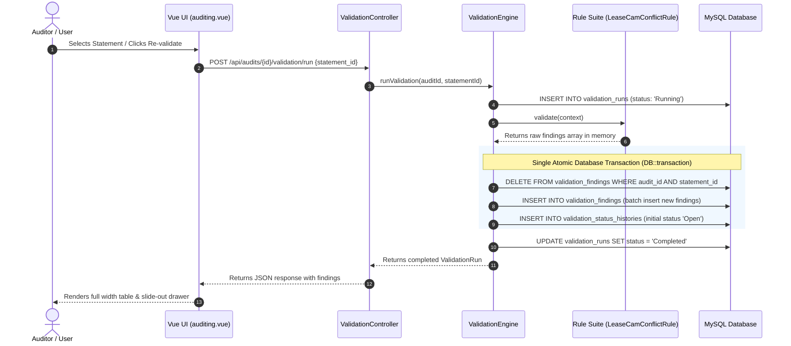

# Expense Statement Validation Requirements & Calculation Logic

**Document Date:** September 7, 2026  
**File Name:** `2026-09-07_validation_requirements_and_calculation_logic.md`  
**System:** MyLease Audit Platform  
**Target Module:** Audit Validation Submenu (`/auditing?tab=validation&id=807`)

---

## 1. Overview & Business Requirements

The **Expense Statement Validation Module** automates the cross-examination of landlord-billed annual Operating Cost (CAM) statements against tenant lease agreements and amendments.

### Primary Objectives
1. **Automated Audit Evaluation:** Select an annual expense statement from a dropdown to automatically trigger rule evaluation against active lease documents.
2. **Lease Version Resolution:** Automatically select the applicable lease document version (**Original Lease** vs. **Lease Amendment**) based on the statement's line item effective date.
3. **Category Inclusion/Exclusion Enforcement:** Identify explicitly prohibited expenses (e.g., capital improvements, structural repairs, executive overhead, legal fees) and flag them immediately as **Excluded (100% Critical Exposure)** without applying caps.
4. **Increase Cap Calculation:** Calculate allowed caps across all 5 standard cap options (`no`, `perc_increase`, `index`, `cost_size`, `fixed_whole`) to detect overcharges (**Cap Exceeded**).
5. **Seamless Drawer UI:** Enable detailed item inspection via a right-side modal drawer while maintaining full-width matrix views.

---

## 2. Core Validation Workflow & Architecture



---

## 3. The 5 Increase Cap Calculation Options & Formulas

The platform evaluates operational cost caps using five standard contractual increase cap structures:

| Cap Option Code | Option Name | Description | Calculation Formula | Exposure Formula |
| :--- | :--- | :--- | :--- | :--- |
| **`no`** | No Cap | Expenses are allowed with no dollar or percentage limit. | $\text{Allowed Max} = \infty$ | $\text{Exposure} = \$0$ |
| **`perc_increase`** | % Increase Cap | Annual expense increase is capped at a fixed percentage over base year. | $\text{Allowed Max} = \text{Base Amount} \times (1 + \text{Cap \%})$ | $\text{Exposure} = \max(0, \text{Statement Amount} - \text{Allowed Max})$ |
| **`index`** | CPI / Index Cap | Expense increase is tied to the Consumer Price Index (CPI) rate. | $\text{Allowed Max} = \text{Base Amount} \times (1 + \text{CPI \%})$ | $\text{Exposure} = \max(0, \text{Statement Amount} - \text{Allowed Max})$ |
| **`cost_size`** | Pro-Rata / Cost Size | Cap is calculated based on building size and tenant's pro-rata share percentage. | $\text{Allowed Max} = \text{Total Building Expense} \times \text{Share \%} \times (1 + \text{Cap \%})$ | $\text{Exposure} = \max(0, \text{Statement Amount} - \text{Allowed Max})$ |
| **`fixed_whole`** | Fixed Dollar Amount | Annual expense category is capped at an explicit maximum dollar ceiling. | $\text{Allowed Max} = \text{Fixed Dollar Limit}$ | $\text{Exposure} = \max(0, \text{Statement Amount} - \text{Fixed Dollar Limit})$ |

---

## 4. Exclusion & Term Bound Rules

### Rule A: Category Exclusion (Preempts Cap Calculations)
If an expense item falls under a category or subcategory marked as **Excluded** in `lease_operation_cost_definitions` or `lease_operation_costs_definition` (e.g., Structural Parking Deck Repairs, Capital Replacement, Executive Salaries, Leasing Commissions):
- **Cap Calculation:** Bypassed completely.
- **Validation Status:** `Excluded` (Red 🔴 badge)
- **Estimated Impact / Exposure:** $100\%$ of the statement line item amount.

### Rule B: Out of Term Bounds
If the statement period or item date falls before the lease `commencement_date` or after `expiration_date`:
- **Validation Status:** `Excluded`
- **Reason:** Expense incurred outside of active lease term bounds.
- **Exposure:** $100\%$ of the item amount.

---

## 5. Concrete Worked Examples (Audit 807 Benchmark Data)

### **Example 1: Fixed Whole Dollar Cap Overcharge (`fixed_whole`)**
* **Statement Item:** Property Management Fee
* **Billed Statement Amount:** $\$32,000$
* **Lease Term Config:** Fixed Cap limit set to $\$15,000$ in Lease Amendment #510
* **Calculation:**
  $$\text{Allowed Max} = \$15,000$$
  $$\text{Exposure} = \$32,000 - \$15,000 = \$17,000$$
* **Result:** **Cap Exceeded** ($\$17,000$ Exposure)

---

### **Example 2: Capital / Structural Exclusion (`Excluded`)**
* **Statement Item:** Structural Parking Deck Reconstruction
* **Billed Statement Amount:** $\$50,000$
* **Lease Clause:** Section 4.2 explicitly excludes structural replacements and capital improvements.
* **Calculation:**
  $$\text{Category Status} = \text{Excluded (Bypass Cap)}$$
  $$\text{Exposure} = 100\% \times \$50,000 = \$50,000$$
* **Result:** **Excluded** ($\$50,000$ Critical Exposure)

---

### **Example 3: Percentage Increase Cap Overcharge (`perc_increase`)**
* **Statement Item:** Building Insurance
* **Billed Statement Amount:** $\$12,000$
* **Base Year Amount:** $\$10,000$
* **Lease Cap Config:** $5.0\%$ Cap Increase Limit
* **Calculation:**
  $$\text{Allowed Max} = \$10,000 \times (1 + 0.05) = \$10,500$$
  $$\text{Exposure} = \$12,000 - \$10,500 = \$1,500$$
* **Result:** **Cap Exceeded** ($\$1,500$ Exposure)

---

### **Example 4: Pro-Rata Building Cost Size Cap (`cost_size`)**
* **Statement Item:** Common Area Janitorial
* **Total Building Expense:** $\$100,000$
* **Tenant Share:** $10\%$ ($\$10,000$ base)
* **Cap Limit:** $3.0\%$
* **Billed Statement Amount:** $\$11,000$
* **Calculation:**
  $$\text{Allowed Max} = \$100,000 \times 10\% \times (1 + 0.03) = \$10,300$$
  $$\text{Exposure} = \$11,000 - \$10,300 = \$700$$
* **Result:** **Cap Exceeded** ($\$700$ Exposure)

---

### **Example 5: Allowed Item with No Cap (`no`)**
* **Statement Item:** Cleaning & Trash Removal
* **Billed Statement Amount:** $\$8,500$
* **Lease Cap Config:** Option `no` (Allowed, No Cap)
* **Calculation:**
  $$\text{Allowed Max} = \infty$$
  $$\text{Exposure} = \$0$$
* **Result:** **Allowed (No Issues)** ($\$0$ Exposure)

---

## 6. Frontend & UI Implementation Features

1. **Full-Width 3-Tab Interface (`auditing.vue`):**
   - `col-12` container layout for maximum table visibility across **1. Expense Statement**, **2. Validation Results**, and **3. Lease Expense Matrix**.
2. **Lease Expense Matrix Cap Formatting:**
   - Displays merged cost categories, option names, and values (e.g., `Included (5.0% Cap)`, `Included (Fixed Whole - $15,000 Cap)`, `Excluded`).
3. **Validation Item Modal Drawer (`showValidationItemDrawer`):**
   - Clicking any item in Validation Results opens a right-side $560\text{px}$ slide-out drawer containing:
     - **Item Summary Grid:** Status badge, Statement Amount, Lease Category, Lease Treatment, and Exposure banner.
     - **Validation Findings:** Clear summary of why the item failed or passed.
     - **Lease Clause Reference:** Cited lease sections and verbatim quotes.
     - **AI Logic & Explanation:** Step-by-step reasoning.
     - **Quick Actions:** `Create Finding` and `Discussion` drawers integration.

---

## 7. Verification & Automated Test Suite

Backend validation service logic is verified by PHPUnit feature tests located at `backend/tests/Feature/ValidationSubmenuTest.php`:

```bash
docker compose exec -T app php artisan test --filter=ValidationSubmenuTest
```

**Test Coverage:**
- `it lists all available statements for audit 807`
- `it executes validation for allowed scenario statement`
- `it executes validation for excluded scenario statement`
- `it executes validation for cap exceeded scenario statement`
- `it matches statement against lease amendment`
- `it calculates all five increase cap types correctly`

---

## 8. Database Tables & Field Mapping Schema

The validation engine reads from and writes to the following primary database tables:

### 1. `audits`
* **Purpose:** Audit project master record.
* **Key Fields:**
  * `id` (PK): Audit identifier (e.g., `807`).
  * `location_id` (FK): Property location reference (`495`).
  * `audit_year`: Target audit fiscal year (`2024`, `2025`).

---

### 2. `leases`
* **Purpose:** Stores lease documents (Original Lease vs. Lease Amendments).
* **Key Fields & Sample Values:**
  * `id` (PK): Lease primary key (e.g., `500`, `510`).
  * `audit_id`, `location_id`: References to audit and property location.
  * `lease_type`: Version indicator (`Original Lease`, `Lease Amendment`).
  * `effective_from_date`: Date version takes effect (`2024-01-01` for Original, `2025-07-01` for Amendment).
  * `commencement_date`, `expiration_date`: Lease term bounds.
  * `tenant_name`: `Acme Logistics Inc`.
  * `landlord_name`: `Apex Real Estate Holdings`.

---

### 3. `lease_increase_caps`
* **Purpose:** Defines increase cap structures per lease document.
* **Key Fields & Sample Values:**
  * `id` (PK): Cap configuration record ID.
  * `lease_id` (FK): Associated lease ID.
  * `type`: Algorithm code (`no`, `perc_increase`, `index`, `cost_size`, `fixed_whole`).
  * `perc_increase_rate`: Percentage value (e.g., `5.0` for 5% cap) or dollar cap ceiling (`15000.00` for fixed whole cap).
  * `from_date`, `to_date`: Effective date range for the cap rule.

---

### 4. `lease_operation_cost_definitions` & `lease_operation_costs_definition`
* **Purpose:** Stores inclusion/exclusion rules defined in lease text (queried across both singular and plural table names).
* **Key Fields & Sample Values:**
  * `lease_id` (FK): Linked lease record.
  * `oper_cost_definition_intro_includes_values` / `pre_ocdo_per_cost_definitionIntro_includes`: Comma-separated allowed expense categories (e.g., `Janitorial & Cleaning, Building Insurance, Real Estate Taxes, Property Management Fee`).
  * `oper_cost_exclusion_intro_includes_values` / `pre_ocd_oper_cost_exclusionIntro_includes`: Comma-separated prohibited categories (e.g., `Roof Replacement, Structural Parking Deck Reconstruction, Landlord Executive Bonus Overhead`).
  * `oper_cost_exclusion_other_values` / `pre_ocd_oper_cost_other`: Text terms for capital/structural exclusions.

---

### 5. `oper_cost_definition_intro_includes_values`
* **Purpose:** Granular per-premise inclusions and exclusions table.
* **Key Fields:**
  * `lease_id`, `premises_id`.
  * `pre_ocdo_per_cost_definitionIntro_includes`: Allowed items list.
  * `pre_ocd_oper_cost_exclusionIntro_includes`: Excluded items list.
  * `pre_ocd_oper_cost_other`: Additional excluded text.

---

### 6. `cost_category` & `cost_sub_category`
* **Purpose:** Category taxonomy used for tab 3 (**Lease Expense Matrix**) grouping.
* **Key Fields & Sample Values:**
  * `cost_category`: `id`, `category_name` (e.g., `Building Insurance`, `Janitorial & Cleaning`, `Management Fees`, `Structural Repairs`).
  * `cost_sub_category`: `id`, `cost_category_id`, `sub_category_name` (e.g., `Building Insurance Policy`, `Janitorial & Facility Sanitation`, `Property Management Fee`).

---

### 7. `statements`
* **Purpose:** Landlord-billed annual expense statement master record.
* **Key Fields & Sample Values:**
  * `id` (PK): Statement ID (e.g., `762` to `766`).
  * `audit_id`, `location_id`, `lease_id`.
  * `name`: Statement title (e.g., `2025 Statement #5 - Increase Cap: Fixed Whole - Lease Amendment`).
  * `cost_year`: Fiscal year of statement (`2025`).
  * `statement_start_date`, `statement_end_date`.

---

### 8. `statement_expenses`
* **Purpose:** Individual expense line items billed on a statement.
* **Key Fields & Sample Values:**
  * `id` (PK): Expense item ID.
  * `statement_id` (FK): Linked statement.
  * `landlord_expense_category` / `rrg_category`: Billed expense name (e.g., `Property Management Fee`, `Structural Parking Deck Reconstruction`).
  * `current_amount`: Billed dollar amount (e.g., `$32,000`, `$50,000`).

---

### 9. `validation_results` & `validation_findings`
* **Purpose:** Persisted output of the validation engine for frontend rendering and finding tracking.
* **Key Fields & Sample Values:**
  * `id` (PK): Result record ID.
  * `validation_id`: Generated human-readable code (e.g., `VF-10001`).
  * `validation_run_id`: Execution log reference (`validation_runs.id`).
  * `audit_id`, `statement_id`, `statement_item_id`.
  * `matched_lease_id`, `matched_lease_type`: Lease version matched (`Original Lease` vs. `Lease Amendment`).
  * `category`: Billed expense name / mapped category (`Property Management Fee`).
  * `issue_type` / `status`: Validation verdict (`Allowed`, `Cap Exceeded`, `Excluded`, `Needs Review`).
  * `severity`: Priority level (`Critical`, `High`, `Medium`, `Low`).
  * `statement_amount`: Total billed amount (e.g., `$32,000`).
  * `allowed_amount`: Computed maximum allowed amount (e.g., `$15,000`).
  * `estimated_exposure`: Financial overcharge amount (e.g., `$17,000`).
  * `reason` / `finding_summary`: Concise finding text (`Property Management Fee exceeds Lease Amendment cap of $15,000.00`).
  * `clause_reference` / `lease_clause_reference`: Cited contract section (e.g., `Section 4.2(c)`).
  * `lease_clause_quote`: Verbatim quote snippet.
  * `ai_explanation`: Comprehensive step-by-step breakdown text.

---

## 9. Validation Findings (`validation_findings`) Lifecycle & Update Mechanics

### **Execution Frequency: Once per Validation Run (Atomic Transaction)**

A common question is whether `validation_findings` records are updated continuously rule-by-rule or all at once.

> **Answer:** Findings are calculated in memory across all rules first, and then written/updated **ONCE per validation run inside a single atomic database transaction (`DB::transaction`)**.



---

### **Step-by-Step Execution Mechanics**

1. **Trigger Event:**
   - Validation runs whenever an auditor selects an expense statement in the dropdown, modifies statement items, or clicks **Re-validate**.
   - An execution entry is logged in `validation_runs` with status `'Running'`.

2. **In-Memory Rule Processing:**
   - The engine iterates through registered rules (`LeaseCamConflictRule`, etc.).
   - Each rule evaluates statements against active lease/amendment definitions and returns finding data arrays into memory (`$rawFindings`).

3. **Atomic Purge & Insert (`DB::transaction`):**
   - **Purge Stale Records:** Existing findings for the target `(audit_id, statement_id)` pair are cleared (`DELETE FROM validation_findings`) to avoid duplicate or outdated findings.
   - **Batch Insert:** New findings generated by the current run are inserted with generated codes (e.g. `VF-10001`).
   - **Audit History Log:** An initial record is logged into `validation_status_histories` (`old_status: null`, `new_status: Open`, `reason: Created by system validation run`).

4. **Completion:**
   - The `validation_runs` status is updated to `'Completed'`.

5. **Post-Validation Manual Updates:**
   - After initial insertion by the system, individual finding records in `validation_findings` are updated when an auditor manually changes a finding's workflow status (`Open` $\rightarrow$ `In Progress` $\rightarrow$ `Resolved` $\rightarrow$ `Accepted`) or creates a formal Audit Finding via the slide-out drawer.


