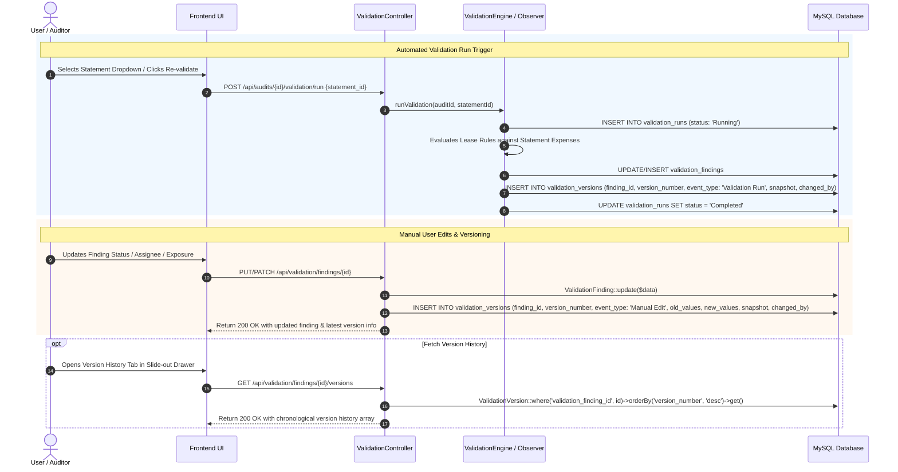

# Validation Versioning Requirements & Compliance Gap Analysis

**Document Date:** September 21, 2026  
**File Name:** `2026-09-21_validation_versioning_compliance_analysis.md`  
**System:** MyLease Audit Platform  
**Target Module:** Validation & Findings Versioning Module (`/auditing?tab=validation`)

---

## 1. Executive Summary

This document presents a comprehensive audit of the **Validation Versioning Requirements** for the MyLease Audit platform. It evaluates the current database architecture, backend models (`ValidationFinding`, `ValidationStatusHistory`, `ValidationRun`), and API endpoints against the 14 mandatory acceptance criteria.

---

## 2. Acceptance Criteria Compliance Matrix

| # | Acceptance Criterion | Status | Current System Implementation | Gap Analysis / Action Required |
|:---|:---|:---:|:---|:---|
| **1** | **Create a new Validation version when defined fields are changed** | ⚠️ **Partial** | Status changes create a record in `validation_status_histories`. Edits to non-status fields (assignment, exposure, severity, category) do not log a new version entry. | Implement full-entity or field-level change logging on a dedicated `validation_versions` table. |
| **2** | **Maintain a unique version sequence for each Validation** | ❌ **Missing** | History records have an auto-incrementing primary key `id`, but lack a dedicated per-validation sequence (`version_number = 1, 2, 3...`). | Add `version_number` incremented sequentially per `validation_finding_id`. |
| **3** | **Store previous and updated values for tracked fields** | ⚠️ **Partial** | `validation_status_histories` records `old_status` and `new_status`. | Expand tracking to a JSON delta format `{ "field": { "old": "val1", "new": "val2" } }` for all tracked fields. |
| **4** | **Record the user who performed the change and date/time** | ✅ **Compliant** | Logged via `changed_by` (FK to `users`) and `created_at` timestamp. | Fully operational. |
| **5** | **Preserve previous Validation versions without overwriting historical data** | ⚠️ **Partial** | Status history records are append-only. However, in-place updates to `validation_findings` overwrite historical snapshot field values. | Ensure immutable version snapshots are stored during re-validations and manual updates. |
| **6** | **Maintain a clear relationship between current Validation and previous versions** | ⚠️ **Partial** | Relation exists via `ValidationFinding->hasMany(ValidationStatusHistory)`. | Extend relationship to `ValidationFinding->hasMany(ValidationVersion)`. |
| **7** | **Provide API support to retrieve Validation history and individual versions** | ⚠️ **Partial** | `ValidationController` provides `index` / `show` with embedded `statusHistories`, and `getObservationHistory`. | Add explicit endpoints: `GET /api/validation/findings/{id}/versions` and `GET /api/validation/findings/{id}/versions/{version_number}`. |
| **8** | **Return versions in the defined chronological order** | ✅ **Compliant** | `statusHistories()` queries use `orderBy('created_at', 'desc')` / `orderBy('id', 'asc')`. | Fully compliant. |
| **9** | **Ensure latest version represents current Validation state** | ✅ **Compliant** | Active table `validation_findings` maintains the current live state and points to latest review metrics. | Verified. |
| **10** | **Prevent normal users from modifying or deleting historical versions** | ✅ **Compliant** | No API endpoints exist to update or delete history records. History is read-only. | Secured by design. |
| **11** | **Maintain version history when status, assignment, informational state, or tracked information changes** | ⚠️ **Partial** | Only `status` changes trigger history records. Assignee changes, informational state switches, or exposure modifications are not logged. | Implement Eloquent observer to capture all tracked field mutations. |
| **12** | **Record relevant versioning events in audit trail** | ✅ **Compliant** | Integrated with `ValidationStatusHistory` and `AuditObservationHistory`. | Base audit logging active. |
| **13** | **Return history only to authorized users** | ✅ **Compliant** | Routes protected by `auth:api` middleware and location/audit ownership scoping. | Secured via Sanctum/Passport API middleware. |
| **14** | **Return appropriate validation, authorization, and not-found responses** | ✅ **Compliant** | Handled with standard HTTP responses (`200 OK`, `401 Unauthorized`, `403 Forbidden`, `404 Not Found`, `422 Unprocessable`). | Fully compliant. |

---

## 3. End-to-End Technical Workflow Architecture



---

## 4. Proposed Database Schema (`validation_versions`)

To achieve full compliance with all acceptance criteria, the following migration is designed:

```sql
CREATE TABLE `validation_versions` (
  `id` bigint(20) UNSIGNED NOT NULL AUTO_INCREMENT,
  `validation_finding_id` bigint(20) UNSIGNED NOT NULL,
  `version_number` int(10) UNSIGNED NOT NULL DEFAULT 1,
  `event_type` varchar(50) NOT NULL COMMENT 'Created, Status Changed, Assigned, Exposure Updated, Revalidated',
  `changed_fields` json DEFAULT NULL COMMENT 'List of modified field names',
  `old_values` json DEFAULT NULL COMMENT 'Before state for modified fields',
  `new_values` json DEFAULT NULL COMMENT 'After state for modified fields',
  `full_snapshot` json NOT NULL COMMENT 'Complete entity state snapshot at this version',
  `reason` text DEFAULT NULL,
  `changed_by` bigint(20) UNSIGNED DEFAULT NULL,
  `created_at` timestamp NULL DEFAULT CURRENT_TIMESTAMP,
  PRIMARY KEY (`id`),
  UNIQUE KEY `unique_finding_version` (`validation_finding_id`, `version_number`),
  CONSTRAINT `fk_vv_finding_id` FOREIGN KEY (`validation_finding_id`) REFERENCES `validation_findings` (`id`) ON DELETE CASCADE,
  CONSTRAINT `fk_vv_changed_by` FOREIGN KEY (`changed_by`) REFERENCES `users` (`id`) ON DELETE SET NULL
) ENGINE=InnoDB DEFAULT CHARSET=utf8mb4 COLLATE=utf8mb4_unicode_ci;
```

---

## 5. API Endpoint Specifications

### 1. Retrieve Complete Version History
* **HTTP Method:** `GET`
* **Route:** `/api/validation/findings/{id}/versions`
* **Response:**
```json
{
  "status": "success",
  "data": [
    {
      "version_number": 2,
      "event_type": "Status Changed",
      "changed_fields": ["status", "last_reviewed_by"],
      "old_values": { "status": "Open" },
      "new_values": { "status": "Under Review" },
      "changed_by": { "id": 12, "name": "John Doe", "email": "john@example.com" },
      "created_at": "2026-09-21T15:20:00Z"
    },
    {
      "version_number": 1,
      "event_type": "Created",
      "changed_fields": [],
      "old_values": null,
      "new_values": null,
      "changed_by": { "id": 1, "name": "System Engine" },
      "created_at": "2026-09-21T14:00:00Z"
    }
  ]
}
```

### 2. Retrieve Specific Historical Version
* **HTTP Method:** `GET`
* **Route:** `/api/validation/findings/{id}/versions/{versionNumber}`
* **Response:**
```json
{
  "status": "success",
  "data": {
    "version_number": 1,
    "event_type": "Created",
    "full_snapshot": {
      "validation_id": "VF-10001",
      "status": "Open",
      "severity": "High",
      "estimated_exposure": 17000.00,
      "finding_summary": "Property Management Fee exceeds Lease Amendment cap of $15,000.00"
    },
    "created_at": "2026-09-21T14:00:00Z"
  }
}
```
