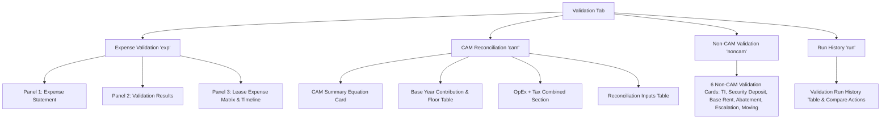

# MyLeaseAudit — Validation Workflow Implementation Reference (AI Agent Context)

> **Purpose:** This document is optimized for AI coding assistants to instantly parse and understand the full implementation of the **MyLeaseAudit Validation System** in `frontend/pages/auditing.vue` without requiring expensive code parsing.

---

## 1. File & Component Architecture

- **Primary Target File:** [`frontend/pages/auditing.vue`](file:///home/c864/Projects/mylease/frontend/pages/auditing.vue)
- **Documentation File:** [`docs/MyLeaseAudit_Validation_Implementation_AI_Reference.md`](file:///home/c864/Projects/mylease/docs/MyLeaseAudit_Validation_Implementation_AI_Reference.md)
- **Specification Source Docs:**
  - [`docs/MyLeaseAudit_Validation_UI_Changes_To_Implement.md`](file:///home/c864/Projects/mylease/docs/MyLeaseAudit_Validation_UI_Changes_To_Implement.md) (Points 1 - 33)
  - [`docs/gemini-code-1790166996875.html`](file:///home/c864/Projects/mylease/docs/gemini-code-1790166996875.html) (HTML/CSS/JS Reference Design)
  - `/home/c864/Downloads/MyLeaseAudit_Validation_Flows_Actual_UI_and_Wireframes_Corrected_v2.docx` (26-Screen Wireframe Specification)

---

## 2. Dynamic Reactive State Variables Summary

All state variables reside in `data()` within `auditing.vue`:

| Variable Name | Type | Purpose / Description |
| :--- | :--- | :--- |
| `validationSubTab` | String (`'exp'\|'cam'\|'noncam'\|'run'`) | Active sub-tab view switcher |
| `validationStatusFilter` | String (`''\|'allowed'\|'cap'\|'excluded'\|'review'\|'info'`) | Dynamic status filter bound to KPI cards & status dropdown |
| `selectedValidationRowItem` | Object / null | Active item selected in Panel 2 Validation Results |
| `selectedLeaseRule` | Object / null | Active rule details loaded in Lease Rule Drawer |
| `selectedNonCamType` | String (`'ti'\|'sec'\|'rent'\|'abate'\|'escl'\|'move'`) | Active Non-CAM category type loaded in Non-CAM Drawer |
| `tiDetermination` | String | TI Allowance determination selector (`Pending`, `Yes`, `No`, etc.) |
| `tiReason` | String | Auditor reasoning text for TI Allowance |
| `selectedStatementVersion` | String (`'V1 – Original'\|'V2 – Detailed Statement'`) | Selected statement version dropdown state |
| `isValidationConfirmed` | Boolean | True when auditor confirms validation run VR-003 |
| `confirmedRunInfo` | Object / null | Audit log containing `{ auditor, timestamp, runId }` |

### Drawer Control Flags

- `showValidationItemDrawer`: Panel 2 Calculation Details Drawer (Points 5, 6, 7, 8)
- `showLeaseRuleDrawer`: Panel 3 Lease Expense Matrix Rule Details Drawer (Point 4)
- `showReviewCorrectDrawer`: Review & Correct Auditor Override Drawer (Point 10 — includes `Save Draft` & `Save & Recalculate`)
- `showPreviewDrawer`: Change Preview & Impact Modal (Points 11, 23)
- `showCamTraceDrawer`: CAM Reconciliation Step-by-Step Calculation Drawer (Point 12)
- `showOpexTaxDrawer`: Operating Expenses & Tax Combined Breakdown Drawer (Point 14)
- `showReconInputDrawer`: Reconciliation Inputs Edit & Review Drawer (Point 15)
- `showNonCamDetailsDrawer`: Non-CAM Item Details Drawer (Points 16 - 22)
- `showEvidenceDrawer`: Evidence Escalation Request Drawer (Point 23)
- `showRunCompareDrawer`: Side-by-Side Run Compare Drawer (Point 25)
- `showConfirmValidationModal`: Validation Confirmation Modal (Point 26)
- `showVersionCompareModal`: Statement Version Comparison Modal (Point 28)
- `showRunScopeModal`: Validation Run Scope & Future-Proof Context Modal (Points 29, 30)

---

## 3. Core Workflow Structure (4 Sub-Tabs)

The validation interface is organized into 4 main sub-tabs via `validationSubTab`:



---

## 4. Key Implementation Points Quick Guide (1 to 33)

### Expense Validation Domain (Points 1 - 10)
- **Point 1 (Panel 2 Validation Table):** 9 Columns (`Expense`, `Billed`, `Allowed`, `Status`, `Exposure`, `Category`, `Lease Treatment`, `Reason`, `Actions`). Includes `Needs Review` (🟡) status filter.
- **Point 2 (Lease Match Banner):** Read-only `.matchnote` callout displaying matched lease name, effective date, why reason, and lock indicator.
- **Point 3 (Lease Timeline):** Read-only historical lease amendment timeline in Panel 3.
- **Point 4 (Lease Rule Matrix Drawer):** Clicking any row in Panel 3 opens `showLeaseRuleDrawer` displaying active rule parameters.
- **Point 5 (5 Cap Types & Dynamic Display):** Full support for `No Cap`, `% Increase`, `Index`, `Cost/Size`, and `Fixed Whole`. Calculation details drawer dynamically binds to `selectedValidationRowItem.capType`.
- **Point 6 (Cap History Trace):** Calculation details drawer filters historical cap rules by active lease and `effectiveDate <= statementDate`.
- **Point 7 (Calculation Details Drawer):** Shows auditable calculation stages (Input → Rule → Calc → Result) and formula evaluation.
- **Point 8 (Excluded Expenses Display):** Excluded items show exact contractual reason, `Allowed: N/A`, and full exposure.
- **Point 9 (Needs Review Workflow):** `Needs Review` status items display `Exposure: Not calculated` and gross tested amount.
- **Point 10 (Review & Correct Drawer):** Preserves immutable engine result (`engineResult`, `engineExposure`), provides separate auditor decision radios, requires mandatory reason when overriding, and features three action buttons: `[Cancel]`, `[Save Draft]`, and `[Save & Recalculate]`.

### CAM Reconciliation Domain (Points 11 - 15)
- **Point 11 (Change Preview Modal):** Dynamically calculates exposure diff before creating proposed run VR-003.
- **Point 12 (CAM Summary Equation & Trace):** Full equation breakdown card (`Bldg Expense * Share % - Exclusions + Floor/Base Adj - Payments = Balance Due`) and calculation trace drawer.
- **Point 13 (Base Year Contribution & Floor):** Category-level base year comparison table with callout confirming **single zero-floor application at pool/tenant level**.
- **Point 14 (OpEx + Tax Combined Section):** Evaluates Operating Expenses and Taxes together with breakdown drawer.
- **Point 15 (Reconciliation Inputs Summary):** Displays tenant share %, base year, floor, tax, and payment evidence with data source tags.

### Non-CAM & Evidence Domain (Points 16 - 23)
- **Point 16 (6 Non-CAM Overview Cards):** Grid displaying 6 specialized Non-CAM validation cards.
- **Point 17 (Tenant Improvement Allowance):** Interactive determination dropdown (`Pending`, `Yes`, `No`, `Partial`, etc.) with reason note input.
- **Point 18 (Security Deposit):** Ledger comparing required vs original vs returned deposit.
- **Point 19 (Base Rent Schedule):** Period-by-period comparison displaying overbilling (`+$1,000`) and underbilling (`-$500`) separately without netting.
- **Point 20 (Expense Abatement):** Verification ledger for free-rent/construction period credits.
- **Point 21 (Rent Escalation):** Month-by-month escalation table with annual increase % and effective date.
- **Point 22 (Moving / Signage Allowance):** Contract allowance balance ledger with evidence attachment state.
- **Point 23 (Evidence Escalation Drawer):** `[Request Evidence]` button & drawer tracking requested documents and affected categories. Displays mandatory policy: *"Unresolved amounts are NOT counted as realized savings until evidence is verified."*

### Run Management & Acceptance (Points 24 - 33)
- **Point 24 (Review Workflow Stepper):** Stepper bar tracking progress (`Source Received` → `Extraction Reviewed` → `Validation Proposed` → `Auditor Review` → `Confirmed`).
- **Point 25 (Run History & Compare Drawer):** Run states (`🟡 Proposed`, `🟢 Confirmed`, `⚪ Superseded`) and side-by-side run comparison drawer (VR-002 vs VR-003).
- **Point 26 (Confirmation Modal):** Confirms run execution, checks outstanding items, and records system auditor audit log.
- **Point 27 & 28 (Statement Version Lineage & Compare):** Version selector (`V1 Original`, `V2 Detailed`) and side-by-side version compare modal.
- **Point 29 & 30 (Run Scope & Future Hooks):** Scope modal detailing rule set version, tolerance, rounding, and future-proof context fields (`Pool`, `Reconciliation Group`, `Rule Version`, `Calculation Context`, `Override Scope`, `Override Version`).
- **Point 31 (Observation / Finding):** Manual observation creation preserved via `Create Finding` / `Edit Draft Observation` actions.
- **Point 32 (Status Badge Color System):**
  - 🟢 **Allowed**: `vld-allowed` (`#edfaed` / `#1f9254`)
  - 🔴 **Excluded**: `vld-excluded` (`#fff0f0` / `#d64545`)
  - 🟠 **Cap Exceeded**: `vld-cap` (`#fff7ea` / `#d97706`)
  - 🟡 **Needs Review**: `vld-review` (`#fdf6e0` / `#c9971f`)
  - 🔵 **Informational**: `vld-info` (`#eef2ff` / `#3b6fd6`)
- **Point 33 (Final Navigation & Inter-Panel Linkage):**
  - **KPI Summary Cards -> Panel 2 Filter:** Clicking any KPI card sets `validationStatusFilter` and filters Panel 2 rows instantly.
  - **Panel 2 Row Selection -> Panel 1 Highlight:** Selecting any row in Panel 2 highlights the corresponding statement item in Panel 1 (`background: #eef0ff; font-weight: 700;`).

---

## 5. Summary Code Snippet for AI Agents

To inspect or modify validation logic in `auditing.vue`, look for the following key sections:

```javascript
// 1. Filtered Validation Results Computed Property
filteredValidationList() {
  let list = this.validationItems || [];
  if (this.validationStatusFilter) {
    list = list.filter(item => item.status === this.validationStatusFilter);
  }
  if (this.validationSearchQuery) {
    const q = this.validationSearchQuery.toLowerCase();
    list = list.filter(item => item.name.toLowerCase().includes(q) || (item.category && item.category.toLowerCase().includes(q)));
  }
  return list;
},

// 2. Panel 1 Highlighting Linkage (Template)
// :style="selectedValidationRowItem && (selectedValidationRowItem.name === item.name || selectedValidationRowItem.category === item.name) ? 'background:#eef0ff;font-weight:700;' : ''"

// 3. Dynamic Cap Type in Calculation Details Drawer (Template)
// {{ selectedValidationRowItem.capType || (selectedValidationRowItem.status === 'cap' ? 'Fixed Whole' : (selectedValidationRowItem.status === 'excluded' ? 'Excluded' : 'No Cap')) }}

// 4. Review & Correct Actions (Template)
// <el-button size="small" @click="showReviewCorrectDrawer = false">Cancel</el-button>
// <el-button size="small" type="info" plain @click="saveReviewCorrectDraft">Save Draft</el-button>
// <el-button size="small" type="primary" @click="saveReviewCorrectDecision">Save & Recalculate</el-button>
```

---
*Created for AI Agent Context Acceleration — MyLeaseAudit Project.*
