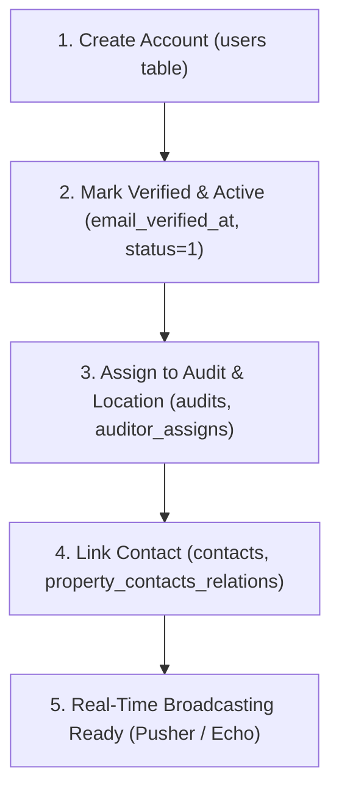

# User Creation, Verification & Audit Assignment Guide

This document provides a step-by-step guide for creating new user accounts, verifying them, assigning them to audits/locations, and ensuring they receive real-time Pusher notifications and discussion `@mentions`.

---

## Table of Contents
1. [Overview](#1-overview)
2. [User Roles Reference](#2-user-roles-reference)
3. [Step 1: Creating & Verifying a User](#step-1-creating--verifying-a-user)
4. [Step 2: Assigning a User to Audits & Locations](#step-2-assigning-a-user-to-audits--locations)
5. [Step 3: Linking User for Discussion @Mentions](#step-3-linking-user-for-discussion-mentions)
6. [Step 4: Testing Real-Time Notifications](#step-4-testing-real-time-notifications)
7. [One-Click PHP Automation Script](#one-click-php-automation-script)

---

## 1. Overview

In MyLeaseAudit, for a user to actively participate in audits, receive real-time discussion notifications, and appear in the `@mention` list, the account requires four steps:



---

## 2. User Roles Reference

| Role ID | Role Name | Description | Default Channel Permissions |
| :--- | :--- | :--- | :--- |
| **1** | Super Admin | System-wide administrative access | Authorized across all channels |
| **2** | Admin | Company administrative access | Authorized across company channels |
| **3** | Company Admin | Client/Company Manager | Authorized for assigned company audits |
| **4** | Auditor | Audit Executor & Analyst | Authorized for assigned audits |
| **5** | Project Manager | Client Project Manager | Authorized for assigned client locations |

---

## Step 1: Creating & Verifying a User

### A. Via PHP / Artisan Command

Run the following command inside the backend container (`myleaseaudit_app`):

```bash
docker exec myleaseaudit_app php -r "
require 'vendor/autoload.php';
\$app = require_once 'bootstrap/app.php';
\$app->make('Illuminate\Contracts\Console\Kernel')->bootstrap();

use App\Models\User;
use Illuminate\Support\Facades\Hash;

\$user = User::updateOrCreate(
    ['email' => 'new.auditor@myleaseaudit.com'],
    [
        'first_name' => 'New',
        'last_name' => 'Auditor',
        'password' => Hash::make('Password123!'),
        'role_id' => 4, // 4 = Auditor, 3 = Company Admin
        'company_id' => 232, // Match your target company ID
        'status' => 1, // 1 = Active
        'email_verified_at' => now() // Verifies account for login
    ]
);

echo 'User Created Successfully! ID: ' . \$user->id . PHP_EOL;
"
```

> [!IMPORTANT]
> If `email_verified_at` is `null` or `status` is not `1`, the frontend login endpoint will reject authentication with the error `"User account is not verified."`

---

## Step 2: Assigning a User to Audits & Locations

To view audit pages and receive thread notifications, the user must be assigned to the Audit or its Location.

### A. Assign as Primary Auditor on an Audit
In the `audits` table, set `auditor_id`:

```bash
docker exec myleaseaudit_app php -r "
require 'vendor/autoload.php';
\$app = require_once 'bootstrap/app.php';
\$app->make('Illuminate\Contracts\Console\Kernel')->bootstrap();

use App\Models\Audit;

// Assign User ID to Audit #800
Audit::where('id', 800)->update(['auditor_id' => 925]);

echo 'Audit #800 assigned to Auditor User ID 925!' . PHP_EOL;
"
```

### B. Assign to Location (`auditor_assigns` table)
Assigning a user to a location grants access to all audits under that location:

```bash
docker exec myleaseaudit_app php -r "
require 'vendor/autoload.php';
\$app = require_once 'bootstrap/app.php';
\$app->make('Illuminate\Contracts\Console\Kernel')->bootstrap();

use App\Models\AuditorAssign;

// Assign User ID 925 to Location ID 495
AuditorAssign::updateOrCreate(
    ['location_id' => 495, 'user_id' => 925],
    ['created_at' => now(), 'updated_at' => now()]
);

echo 'User ID 925 assigned to Location ID 495!' . PHP_EOL;
"
```

---

## Step 3: Linking User for Discussion @Mentions

The discussion drawer populates `@mention` lists using assigned contacts. Create a matching entry in `contacts` and `property_contacts_relations`:

```bash
docker exec myleaseaudit_app php -r "
require 'vendor/autoload.php';
\$app = require_once 'bootstrap/app.php';
\$app->make('Illuminate\Contracts\Console\Kernel')->bootstrap();

use App\Models\Contacts;
use Illuminate\Support\Facades\DB;

// 1. Create/Update Contact Entry
\$contact = Contacts::updateOrCreate(
    ['email_address' => 'new.auditor@myleaseaudit.com'],
    [
        'name' => 'New Auditor',
        'title' => 'Auditor',
        'company_id' => 232,
        'contact_role_id' => 1,
        'is_active' => 1
    ]
);

// 2. Link Contact to Audit #800 & Location #495
DB::table('property_contacts_relations')->updateOrInsert(
    ['contact_id' => \$contact->id, 'assigned_type' => 'audit', 'assigned_type_id' => 800],
    ['created_at' => now(), 'updated_at' => now()]
);

DB::table('property_contacts_relations')->updateOrInsert(
    ['contact_id' => \$contact->id, 'assigned_type' => 'location', 'assigned_type_id' => 495],
    ['created_at' => now(), 'updated_at' => now()]
);

echo 'Contact ID ' . \$contact->id . ' linked to Audit 800 and Location 495!' . PHP_EOL;
"
```

---

## Step 4: Testing Real-Time Notifications

### 1. Open Two Isolated Browsers
- **Sender Window**: Normal Chrome window (e.g. `sender.test@myleaseaudit.com`).
- **Receiver Window**: Incognito window (`Ctrl + Shift + N`) or Firefox (e.g. `new.auditor@myleaseaudit.com`).

### 2. Send Message
1. In the **Sender Window**, open the Discussion Drawer on Audit #800.
2. Type `@New` and select **New Auditor** from the dropdown list.
3. Click **Send**.

### 3. Verify Real-Time Delivery
In the **Receiver Window**, the browser will automatically:
- Receive the broadcast over `private-App.Models.User.{userId}` and `discussion.audit.{auditId}`.
- Display a floating notification toast popup on screen.
- Increment the bell badge counter in the top header.

---

## One-Click PHP Automation Script

Copy and save the script below as `create_and_assign_user.php` in your backend root or run it via `artisan`:

```php
<?php

require 'vendor/autoload.php';
$app = require_once 'bootstrap/app.php';
$app->make('Illuminate\Contracts\Console\Kernel')->bootstrap();

use App\Models\User;
use App\Models\Audit;
use App\Models\AuditorAssign;
use App\Models\Contacts;
use Illuminate\Support\Facades\Hash;
use Illuminate\Support\Facades\DB;

// --- CONFIGURATION ---
$email = 'auditor.demo@myleaseaudit.com';
$firstName = 'Demo';
$lastName = 'Auditor';
$password = 'Password123!';
$companyId = 232;
$roleId = 4; // 4 = Auditor
$auditId = 800; // Target Audit ID

echo "=== 1. CREATING USER ACCOUNT ===" . PHP_EOL;
$user = User::updateOrCreate(
    ['email' => $email],
    [
        'first_name' => $firstName,
        'last_name' => $lastName,
        'password' => Hash::make($password),
        'role_id' => $roleId,
        'company_id' => $companyId,
        'status' => 1,
        'email_verified_at' => now()
    ]
);
echo "User Account Created: ID={$user->id} | Email={$user->email}" . PHP_EOL;

echo "=== 2. ASSIGNING TO AUDIT & LOCATION ===" . PHP_EOL;
$audit = Audit::find($auditId);
if ($audit) {
    $audit->auditor_id = $user->id;
    $audit->save();

    if ($audit->location_id) {
        AuditorAssign::updateOrCreate(
            ['location_id' => $audit->location_id, 'user_id' => $user->id],
            ['created_at' => now(), 'updated_at' => now()]
        );
        echo "Assigned to Audit #{$audit->id} and Location #{$audit->location_id}" . PHP_EOL;
    }
}

echo "=== 3. LINKING CONTACT FOR @MENTIONS ===" . PHP_EOL;
$contact = Contacts::updateOrCreate(
    ['email_address' => $email],
    [
        'name' => "{$firstName} {$lastName}",
        'title' => 'Auditor',
        'company_id' => $companyId,
        'contact_role_id' => 1,
        'is_active' => 1
    ]
);

if ($audit) {
    DB::table('property_contacts_relations')->updateOrInsert(
        ['contact_id' => $contact->id, 'assigned_type' => 'audit', 'assigned_type_id' => $audit->id],
        ['created_at' => now(), 'updated_at' => now()]
    );
    if ($audit->location_id) {
        DB::table('property_contacts_relations')->updateOrInsert(
            ['contact_id' => $contact->id, 'assigned_type' => 'location', 'assigned_type_id' => $audit->location_id],
            ['created_at' => now(), 'updated_at' => now()]
        );
    }
}
echo "Contact Link Created: ID={$contact->id}" . PHP_EOL;

echo "=== SUCCESS: USER READY FOR LOGGING IN & REALTIME NOTIFICATIONS ===" . PHP_EOL;
```

---
*Documented on September 1, 2026 for MyLeaseAudit Application.*

Sender (sender.test@myleaseaudit.com / Password123!): Log in in normal browser window.
Receiver (receiver.test@myleaseaudit.com / Password123!): Log in in Incognito window.
